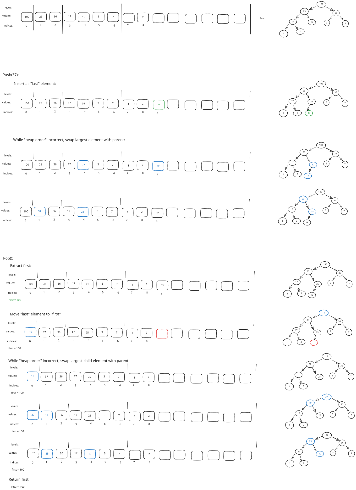

\newpage
# Lists
## Dynamic array 
<!--
    - Je implementeert twee typen reeksen en maakt een vergelijking tussen de implementaties.
    - Je legt uit welke onderdelen van je code zich lenen voor verbeteringen die impact hebben op de performance.
-->

### Description
An array that resizes when needed, producing a seemingly growable array outwards.

Sadly due to the nature of Go, an array can't be allocated with variable size at runtime. An array can
only be allocated with a literal or with a constant. Allocating an array with a size only known at runtime
is not allowed, instead you'll have to use a slice, which is already a dynamic array. The implementation
therefore is in reality a dynamic array based of a dynamic array treated as if it's a normal array. The overhead is 
luckily minimal since in Go data is separated from methods. The space overhead is limited to the slice header,
which includes a pointer to the array, a length, and a capacity. Runtime overhead is limited to the pointer
indirection to reach the array.

### Performance optimizations
Prepending can be more efficient if the same resizing algorithm would work in both directions. Where upon resizing
the data structure determines a window determined as the "list". Then prepending would just move a pointer and
insert before that, just as it would with an append. The tradeoff would be space efficiency. This could be useful
if ones expects to use both prepend and append on the same list.

### Performance
| Operation | Best   | Worst  |
|-----------|--------|--------|
| SetAt     | `O(1)` | `O(1)` |
| GetAt     | `O(1)` | `O(1)` |
| Append    | `O(1)` | `O(n)` |
| Prepend   | `O(n)` | `O(n)` |
| RemoveAt  | `O(n)` | `O(n)` |
| Remove    | `O(n)` | `O(n)` |
: Dynamic array time complexities

BenchmarkSetAt
BenchmarkSetAt/100
BenchmarkSetAt/100-4  	396980238	         2.983 ns/op
BenchmarkSetAt/1000
BenchmarkSetAt/1000-4 	456585552	         2.492 ns/op
BenchmarkSetAt/10000
BenchmarkSetAt/10000-4         	494775049	         2.361 ns/op
BenchmarkSetAt/100000
BenchmarkSetAt/100000-4        	496438935	         2.400 ns/op

BenchmarkGetAt
BenchmarkGetAt/100
BenchmarkGetAt/100-4           	434404981	         2.727 ns/op
BenchmarkGetAt/1000
BenchmarkGetAt/1000-4          	437471620	         2.723 ns/op
BenchmarkGetAt/10000
BenchmarkGetAt/10000-4         	445334864	         2.690 ns/op
BenchmarkGetAt/100000
BenchmarkGetAt/100000-4        	442616635	         2.693 ns/op

BenchmarkAppend
BenchmarkAppend/Worst-100
BenchmarkAppend/Worst-100-4    	 2707586	       441.1 ns/op
BenchmarkAppend/Worst-1000
BenchmarkAppend/Worst-1000-4   	  825801	      1344 ns/op
BenchmarkAppend/Worst-10000
BenchmarkAppend/Worst-10000-4  	  115230	     11820 ns/op
BenchmarkAppend/Worst-100000
BenchmarkAppend/Worst-100000-4 	    2841	    451452 ns/op

#### SetAt
Always occurs in `O(1)`, utilizes random access to the underlying array.

#### GetAt
Always occurs in `O(1)`, utilizes random access to the underlying array.

#### Append
Best case occurs when there is enough capacity to append. Highly likely to occur.

Worst case occurs when there is not enough capacity to append, requiring a reallocation and copying. Generally
unlikely to occur.

#### Prepend
Always occurs in `O(n)` due to it not being optimized to reserve capacity at this side of the list, requiring
shifting all elements, and optionally a reallocation beforehand.

#### RemoveAt
Best case occurs when the last element is removed, requiring only the `length` has to be decreased then.

Worst case occurs when the first element is removed, requiring all remaining elements to be shifted to the left.

#### Remove
Always occurs in `O(n)`. It has to do a linear search of `n` to remove the last element, or perform
a `n`-sized shift to left if the first value has to be removed.

\newpage
## Linked list
<!--
    - Je implementeert twee typen reeksen en maakt een vergelijking tussen de implementaties.
    - Je legt uit welke onderdelen van je code zich lenen voor verbeteringen die impact hebben op de performance.
-->

### Description
A list implemented by separate parts that are connected through pointers stored in each. This indirection means
it does not require a continuous memory like an array to function, making it faster to remove and insert in the
middle of the list; there is no need for resizing, making performance highly consistent. Yet due to this
same characteristic of indirection random access is sacrificed. 

Appends have been optimized simply by maintaining and utilizing a `tail`. It represents the last node in the list.
This avoids going through the whole list, just to add something to the end. Instead, it's inserted straight after
the tail. The tradeoff is that the constant time of any insert is larger due to checking or at least updating the
`tail`.

Many of special cases of linked list operations have been eliminated by having a _fake_ `head`; it does not actually
contain any meaningful data except that it points to the next node. Any inserts or removals of the first node do not
require checking for the `head` being `nil`, since the `head` is ensured to be there.

Operations, such as `InsertAfter` and `RemoveAfter` have been introduced to make mutations in the middle
of the list efficient when the caller knows the physical location of the node before. Helper methods exist
to look these up.

### Potential optimizations
A major benefit of a linked list is it's ability to insert or delete elements generally at constant time, that is
if we know the node before, or if it's at the end or beginning, not requiring any resizing. Yet, it sacrifices
space and speed of iteration to achieve this. Perhaps a specialized middle ground is to have a linked list based
of a dynamic array. Where the array contains a node at every index. Then the order is maintained just as with a 
normal linked list: a reference (index) in that node to the next node. This ensures the data is stored in an
continuous block of memory, increasing the spatial locality heavily. Removals can then be done via swapback, and 
a freelist can be maintained to ensure a dense array. A tradeoff is that it now also enjoys, although more
contained, same negatives as a dynamic array.

Making it circular will allow more efficient incremental mutations.

### Performance
| Operation   | Best   | Worst  |
|-------------|--------|--------|
| SetAt       | `O(1)` | `O(n)` |
| GetAt       | `O(1)` | `O(n)` |
| Append      | `O(1)` | `O(1)` |
| Prepend     | `O(1)` | `O(1)` |
| RemoveAt    | `O(1)` | `O(n)` |
| Remove      | `O(1)` | `O(n)` |
|             |        |        |
| InsertAfter | `O(1)` | `O(1)` |
| RemoveAfter | `O(1)` | `O(1)` |
: Linked List time complexities

BenchmarkSetAt
BenchmarkSetAt/FirstElement-100
BenchmarkSetAt/FirstElement-100-4         	399138332	         2.880 ns/op
BenchmarkSetAt/FirstElement-1000
BenchmarkSetAt/FirstElement-1000-4        	433926813	         2.762 ns/op
BenchmarkSetAt/FirstElement-10000
BenchmarkSetAt/FirstElement-10000-4       	433902901	         2.758 ns/op
BenchmarkSetAt/FirstElement-100000
BenchmarkSetAt/FirstElement-100000-4      	420236277	         2.767 ns/op
BenchmarkSetAt/LastElement-100
BenchmarkSetAt/LastElement-100-4          	10770968	       109.1 ns/op
BenchmarkSetAt/LastElement-1000
BenchmarkSetAt/LastElement-1000-4         	  843501	      1365 ns/op
BenchmarkSetAt/LastElement-10000
BenchmarkSetAt/LastElement-10000-4        	   79680	     14976 ns/op
BenchmarkSetAt/LastElement-100000
BenchmarkSetAt/LastElement-100000-4       	    6944	    206997 ns/op
BenchmarkGetAt
BenchmarkGetAt/FirstElement-100
BenchmarkGetAt/FirstElement-100-4         	345588264	         3.453 ns/op
BenchmarkGetAt/FirstElement-1000
BenchmarkGetAt/FirstElement-1000-4        	352650915	         3.392 ns/op
BenchmarkGetAt/FirstElement-10000
BenchmarkGetAt/FirstElement-10000-4       	353544301	         3.373 ns/op
BenchmarkGetAt/FirstElement-100000
BenchmarkGetAt/FirstElement-100000-4      	355348230	         3.381 ns/op
BenchmarkGetAt/LastElement-100
BenchmarkGetAt/LastElement-100-4          	10894947	       108.2 ns/op
BenchmarkGetAt/LastElement-1000
BenchmarkGetAt/LastElement-1000-4         	  873637	      1346 ns/op
BenchmarkGetAt/LastElement-10000
BenchmarkGetAt/LastElement-10000-4        	   83584	     14172 ns/op
BenchmarkGetAt/LastElement-100000
BenchmarkGetAt/LastElement-100000-4       	    7682	    156266 ns/op
BenchmarkAppend
BenchmarkAppend/100
BenchmarkAppend/100-4                     	 6845341	       181.6 ns/op
BenchmarkAppend/1000
BenchmarkAppend/1000-4                    	 6003750	       202.8 ns/op
BenchmarkAppend/10000

#### SetAt
Best case occurs when the first element is set, requiring constant linked list traversal.

Worst case occurs when the last element is set, requiring full linked list traversal.

#### GetAt
Best case occurs when the first element is requested.

Worst case occurs when the last element is requested. The optimization of maintaining a `tail` is not used
at this moment.

#### Append
Any `Append` is in constant time. Due to maintaining the `tail`, only updates on some pointers need to be performed.

#### Prepend
Any `Prepend` is in constant time. Due to maintaining the `head`, only updates on some pointers need to be performed.

#### RemoveAt
Best case occurs when the first element is removed.

Worst case occurs when the last element is removed. The optimization of maintaining a `tail` is not used
at this moment.

#### Remove
Best case occurs when the first element is removed.

Worst case occurs when the last element is removed. The optimization of maintaining a `tail` is not used
at this moment.

#### InsertAfter
Any `InsertAfter` is int constant time. Due to knowing the node before, only updates on some pointers need to be
performed.

#### RemoveAfter
Any `InsertAfter` is int constant time. Due to knowing the node before, only updates on some pointers need to be
performed.


\newpage
## Comparison
<!--
    - Je implementeert twee typen reeksen en maakt een vergelijking tussen de implementaties.

    - Je onderbouwt de verschillen tussen de twee implementaties en maakt hierbij gebruik 
    van de concepten time complexity en execution time. Je behandelt hierbij zowel het 
    slechtst mogelijke geval als het best mogelijke geval en legt uit waarin deze van elkaar verschillen.
-->


\newpage
# Priority Queue
<!--
    - Je implementeert een priority queue.
    - Je legt uit op welke manier je de priority implementeert en onderbouwt waarom je voor deze methode hebt gekozen.
    - Je onderbouwt de performance van je implementatie en maakt hierbij gebruik van de concepten 
    time complexity en execution time. Je behandelt hierbij zowel het slechtst mogelijke geval als het 
    best mogelijke geval en legt uit waarin deze van elkaar verschillen.
    - Je legt uit welke onderdelen van je code zich lenen voor verbeteringen die impact hebben op de performance.
-->

```go
// Alias of a binary heap
type PriorityQueue[TPriority cmp.Ordered, TValue any] = binheap.BinHeap[TPriority, TValue]

func New[TPriority cmp.Ordered, TValue any](capacity int) *PriorityQueue[TPriority, TValue] {
	return binheap.New[TPriority, TValue](capacity)
}
```

```go
type BinHeap[TOrder cmp.Ordered, TValue any] struct {
	nodes []Node[TOrder, TValue]
}

func New[TOrder cmp.Ordered, TValue any](capacity int) *BinHeap[TOrder, TValue] {
	return &BinHeap[TOrder, TValue]{
		nodes: make([]Node[TOrder, TValue], 0, capacity),
	}
}

func (h *BinHeap[TOrder, TValue]) Push(order TOrder, value TValue) {
	h.nodes = append(h.nodes, *NewNode(order, value))

	length := len(h.nodes)
	if length == 1 {
		return
	}

	// While "heap order" incorrect, swap inserted with parent
	insertedAt := length - 1
	nodes := h.nodes
	for {
		parentAt := (insertedAt - 1) / 2 // `>> 1` is the same as `/ 2`, but more performant
		if parentAt < 0 {
			break
		}

		if order <= nodes[parentAt].order {
			break
		}

		nodes[parentAt], nodes[insertedAt] = nodes[insertedAt], nodes[parentAt]
	}
}

// for better CPU Cache performance, perhaps separate values from priorities.
// Priorities are worked on most of the time, while the value is generally
// only acted upon about once per function.
// By separating more priorities can be put into cache (spatial locality),
// while the once accessed data can remain out of cache, without any big consequence.

func (h *BinHeap[TOrder, TValue]) Pop() (TValue, bool) {
	length := len(h.nodes)
	if length == 0 {
		var value TValue
		return value, false
	}

	// Extract first while we still can
	first := h.nodes[0]

	// Move "last" to "first", and remove "last"
	h.nodes[0] = h.nodes[length-1]
	h.nodes = h.nodes[:length-1]
	length--

	// While "heap order" incorrect -> swap largest child with inserted
	nodes := h.nodes
	insertedAt := 0
	for {
		leftChildAt := insertedAt*2 + 1
		rightChildAt := insertedAt*2 + 2
		largestAt := insertedAt

		if leftChildAt < length && nodes[leftChildAt].order > nodes[largestAt].order {
			largestAt = leftChildAt
		}
		if rightChildAt < length && nodes[rightChildAt].order > nodes[largestAt].order {
			largestAt = rightChildAt
		}

		if largestAt == insertedAt { // We didn't find a larger child
			break
		}

		nodes[largestAt], nodes[insertedAt] = nodes[insertedAt], nodes[largestAt]
		insertedAt = largestAt
	}

	return first.value, true
}
```

```go
type Node[TPriority cmp.Ordered, TValue any] struct {
	order TPriority
	value TValue
}

func NewNode[TPriority cmp.Ordered, TValue any](priority TPriority, value TValue) *Node[TPriority, TValue] {
	return &Node[TPriority, TValue]{
		order: priority,
		value: value,
	}
}
```

### Description
A priority queue is implemented using a binary heap. The binary heap, although representing a binary tree, is stored
as an array, or dynamic array in this case^[A slice is the go variant]. It allows optimized priority queue
operations due to the maintenance of the shape and heap properties:

Shape: Every level is fully filled except the deepest one. By ensuring this the algorithm may have better 
existential knowledge, thus reducing checks.

Heap: In our case, every child node is lesser or equal to it's parent. The algorithm knows where the 
_largest_ node remains at, namely the root node. The heap property, combined with that the root node 
is a parent but not a child, ensures this will always remain constant. The rest of the ordering mainly
makes it easier to maintain the property itself, i.e. less comparisons for insertions and deletions.



### Performance

Operation | Best | Worst |
| ------ | --- | --- |
| Push | `O(1)` | `O(log n)` |
| Pop | `O(1)` | `O(log n)` |

#### Push
Best case occurs when the node added to the _bottom_ contains a smaller priority than it's direct parent. 
Thus not requiring no maintenance of the heap property.

Worst case occurs when the node added to the _bottom_ contains the largest priority in the collection. Thus
requiring maintenance of the heap property through all layers.

#### Pop
Best case occurs when the root node is swapped with the _last_ node containing the largest value in the
new collection. Thus requiring no maintenance of the heap property.

Worst case occurs when the root node is swapped with the _last_ node containing the smallest value in the 
new collection. Thus requiring maintenance of the heap property through all layers.

### Potential optimizations
The node structures should be implicit, not explicit; priorities should be separated from values.
Associated values are only important for the final _setting_ or _getting_, all other logic operates
on priorities. The algorithm can fit more _hot_ data in the CPU cache by minimizing on putting in
_cold_ data. Thus improving operations for a larger `n`.

A node should have more than two children. The spatial locality can be made more relevant by increasing the amount of children a parent has, since 
it leads to a more continous memory block. Downwards maintenance of the heap property ensures a comparison
per child. An iteration's comparisons may have more cache hits due to the more relevant spatial locality.

\newpage
# Sorting
## Merge sort
<!--
    - Je implementeert een merge sort algoritme en 1 ander sorteeralgoritme naar 
    keuze (NIET parallel merge sort) en maakt een vergelijking tussen de implementaties.
    - Je legt uit welke onderdelen van je code zich lenen voor verbeteringen die impact hebben op de performance.
-->
```go
func Sort[T cmp.Ordered](list []T) []T {
	listLength := len(list)

	readFrom := list
	writeTo := make([]T, listLength)

	if listLength % 2 != 0 { // uneven
		writeTo[listLength - 1] = readFrom[listLength - 1]
	}

	var leftStartAt int
	var rightStartAt int
	var rightEndedAt int 

	var nextLeftAt int
	var nextRightAt int
	var insertAt int

	partLength := 1
	mergeLength := 2
	for partLength < listLength {
		leftStartAt = 0
		rightStartAt = leftStartAt + partLength
		rightEndedAt = min(mergeLength, listLength)
		insertAt = 0
		for rightStartAt < listLength {
			nextLeftAt = leftStartAt
			nextRightAt = rightStartAt

			// merge items
			for nextLeftAt < rightStartAt && nextRightAt < rightEndedAt {
				if readFrom[nextLeftAt] < readFrom[nextRightAt] {
					writeTo[insertAt] = readFrom[nextLeftAt]

					nextLeftAt++
				} else {
					writeTo[insertAt] = readFrom[nextRightAt]

					nextRightAt++
				}

				insertAt++
			}
			// insert leftover `left` items if there are any
			for ; nextLeftAt < rightStartAt; nextLeftAt++ {
				writeTo[insertAt] = readFrom[nextLeftAt]
				insertAt++
			}
			// insert leftover `right` items if there are any
			for ; nextRightAt < rightEndedAt; nextRightAt++ {
				writeTo[insertAt] = readFrom[nextRightAt]
				insertAt++
			}

			// prepare for next iteration
			leftStartAt += mergeLength
			rightStartAt += mergeLength
			rightEndedAt = min(rightEndedAt+mergeLength, listLength)
		}

		// prepare for next merge iteration
		partLength += partLength
		mergeLength += mergeLength

		readFrom, writeTo = writeTo, readFrom
	}

	return readFrom
}
```
### Description
Best case time complexity: `O(n log n)`
Worst case time complexity: `O(n log n)`
Worst case space complexity: `O(n)`

BenchmarkSortTinyLength
BenchmarkSortTinyLength-4      	 8932950	       118.2 ns/op
BenchmarkSortSmallLength
BenchmarkSortSmallLength-4     	   80596	     14150 ns/op
BenchmarkSortMediumLength
BenchmarkSortMediumLength-4    	    7016	    167337 ns/op
BenchmarkSortLargeLength
BenchmarkSortLargeLength-4     	     487	   2407848 ns/op

It starts with the smallest unit of partition that is meaningful and sorted by definition: a one item partition.

Then, every iteration the whole array's partitions are _merged_ into a 
larger partitions, this is done until the whole array is sorted.
A divide-and-conquer algorithm. 

### Noteworthy optimizations
Two arrays are maintained: one for reading the state before the current iteration, and one to write new state to while in
this iteration. These are then swapped after an iteration has completed. Here, we initialize the `readFrom` as the given list,
and the `writeTo` as an new list. Lessening time spent on memory management and copying operations.

The iterative approach, opposed to resursive, also lessens time and space usage, since there is no overhead done for this
algorithm on the call stack.

### Potential optimizations
Each merge iteration uses each item exactly once, and if the length of the list is larger than the CPU cache capacity, then
these are removed from it before they are used again in the next iteration. This generally leads to dreadful locality. Temporal 
locality may be improved by only merging subarrays that fit into the cache, and then merging the whole array from that point on.
Then a memory-optimized heap can be used to increase spatial locality for the last phase of mentioned improvement. [@CachePerfSorting]

Merging has significant overhead, which makes it worse for smaller partitions. By falling back to 
another sorting algorithm that can better handle this workload. Perhaps lowering time and space utilization.

Merging subarrays in reversed order would allow simpler boundary checking, perhaps lowering time and space
utilization.

## Insertion sort
<!--
    - Je implementeert een merge sort algoritme en 1 ander sorteeralgoritme naar 
    keuze (NIET parallel merge sort) en maakt een vergelijking tussen de implementaties.
    - Je legt uit welke onderdelen van je code zich lenen voor verbeteringen die impact hebben op de performance.
-->

## Comparison
<!--
    - Je implementeert een merge sort algoritme en 1 ander sorteeralgoritme naar 
    keuze (NIET parallel merge sort) en maakt een vergelijking tussen de implementaties.
    - Je onderbouwt de verschillen tussen de twee implementaties en maakt 
    hierbij gebruik van de concepten time complexity, execution time en space complexity. Je 
    behandelt hierbij zowel het slechtst mogelijke geval als het best mogelijke geval en 
    legt uit waarin deze van elkaar verschillen.
--> 

BenchmarkSortTinyLength
BenchmarkSortTinyLength-4     	68335273	        15.40 ns/op
BenchmarkSortSmallLength
BenchmarkSortSmallLength-4    	 1000000	      1055 ns/op
BenchmarkSortMediumLength
BenchmarkSortMediumLength-4   	  111880	     10653 ns/op
BenchmarkSortLargeLength
BenchmarkSortLargeLength-4    	       1	1775333795 ns/op

\newpage
# Hash Table
<!--
    - Je implementeert een hash table.
    - Je legt uit hoe je hashing-algoritme werkt en onderbouwt je keuze voor het specifieke algoritme.
    - Je legt uit welke onderdelen van je code zich lenen voor verbeteringen die impact hebben op de performance.
-->

### Description

### Performance

### Noteworthy optimizations

### Potential optimizations
Use straight _unsafe_ binary interpretation of given keys, instead of explicitly type casting to a `[]byte` which
requires a copy to be made.

Resizing, and specifically incremental resizing, to keep operations just as efficient as upon initialization.

Use a dynamic array instead of a linked list. In well optimized hash tables buckets are kept small to maintain
an amortized time complexity of `O(1)`

\newpage
# Binary Search
<!--
    - Je implementeert een binary search.
    - Je onderbouwt de performance van je implementatie en maakt hierbij gebruik van de concepten time 
    complexity en execution time. Je behandelt hierbij zowel het slechtst mogelijke geval als het 
    best mogelijke geval en legt uit waarin deze van elkaar verschillen.
    - Je legt uit welke onderdelen van je code zich lenen voor verbeteringen die impact hebben op de performance.
-->

```go
func Search[TValue cmp.Ordered](values []TValue, value TValue) (int, error) {
	rightAt := len(values) - 1
	if rightAt < 0 {
		return -1, collections.ErrNotFound
	}

	leftAt := 0
	var middleAt int
	for leftAt != rightAt {
		middleAt = (rightAt - leftAt) / 2 + leftAt
		if value > values[middleAt] {
			leftAt = middleAt + 1
		} else { // value <= values[middleAt]
			// we assume value < values[middleAt], to prevent an repeated check, and
			// instead rely on our loop boundary condition.
			rightAt = middleAt
		}
	}

	if value == values[leftAt] {
		return leftAt, nil
	}

	return -1, collections.ErrNotFound
}
```

### Description
Binary search utilizes the ordered nature of given `values` to 
make educated guesses of where the given `value` might be. Binary research makes 
educated guesses every iteration, and checks it's relativity to the given `value`,
to determine the next educated guess. Every iteration roughly halves the search area. 

In this implementation, opposed to more traditional approaches, this _halving_ 
goes on until there is only one value left. 

This approach is taken since the actual repeating binary search, i.e. the loop, actually
uses a binary check, a `if`-`else`. Many implementations check the value at the guess `middleAt`
to be larger, smaller and equal. This way an early return may be used for equality. Yet, the 
cost is an additional conditional. The chance for a guess to be accurate is with unbounded 
length of `values` generally extremely low. Thus, this implementation just assumes for every
iteration that if `value <= values[middleAt]`, then we assume `value < values[middleAt]`, since
that is very likely to be true. Yet, since equality is theoretically possible we can't assign our
next `rightAt` to be `middleAt - 1` to prevent removing that possibility from our search area.

Then our search naturally converges, where `leftAt == rightAt`, and one value is left,
which is checked for equality to produce the desired function return types.

### Complexity
The time complexity stays the same for every non-zero input since it always keeps halving 
until there is one value left: `O(logN)`, where `N == len(values)`

BenchmarkSearch
BenchmarkSearch/Best-100
BenchmarkSearch/Best-100-4         	80513196	        13.03 ns/op
BenchmarkSearch/Best-1000
BenchmarkSearch/Best-1000-4        	71219486	        17.00 ns/op
BenchmarkSearch/Best-10000
BenchmarkSearch/Best-10000-4       	45908029	        25.15 ns/op
BenchmarkSearch/Best-100000
BenchmarkSearch/Best-100000-4      	38398981	        31.56 ns/op

### Execution time

### Potential improvements
The additional error return value, although consistent with other styles, it can be optimized
to use a `bool` instead. Go wraps interface types like `error`, thus adding interface allocation
overhead. Perhaps even easier, but arguably less safe, a int value of `-1` may be used to 
indicate that the value is not found.

The arithmatic calculation of `middleAt` could perhaps be replaced with bitwise operations, specifically
using a bitwise right shift to perform the halving division.

\newpage
# Graphs
## [Graph implementation]
<!--
    - Je implementeert Dijkstra's algoritme. Hiervoor gebruik je een door jou 
    zelf ontwikkelde implementatie van een graaf.
    - Je onderbouwt de performance van je implementatie van een graaf en maakt hierbij 
    gebruik van de concepten time complexity en execution time.
    - Je legt uit welke onderdelen van je code zich lenen voor verbeteringen die impact hebben op de performance.
-->
## Dijkstra's
<!--
    - Je implementeert Dijkstra's algoritme. Hiervoor gebruik je een door jou zelf 
    ontwikkelde implementatie van een graaf.
    - Je onderbouwt de performance van je implementatie van Dijkstra's 
    algoritme en maakt hierbij gebruik van de concepten time complexity en execution time.
    - Je legt uit welke onderdelen van je code zich lenen voor verbeteringen die impact hebben op de performance.
-->

